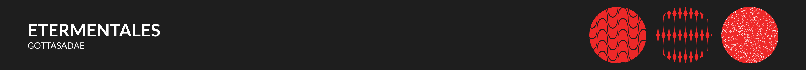

# Faculdade

- [[Introdução à Programação]]
- 

- [[Domínios de Software]]
- [[Design de Software]]
- [[Processos de Qualidade de Software]]
- [[Gerência de Projeto de Software]]

# Extras

- [[Front-end]]
- [[Back-end]]
- [[Design]]
- [[DevOps]]

# Normas relevantes

- [[ISO IEC IEEE 12207]]
- [[ISO IEC IEEE 15289]]
- 